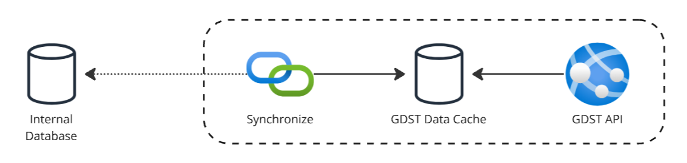
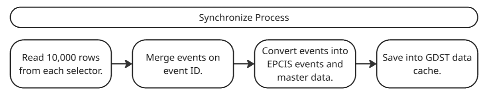
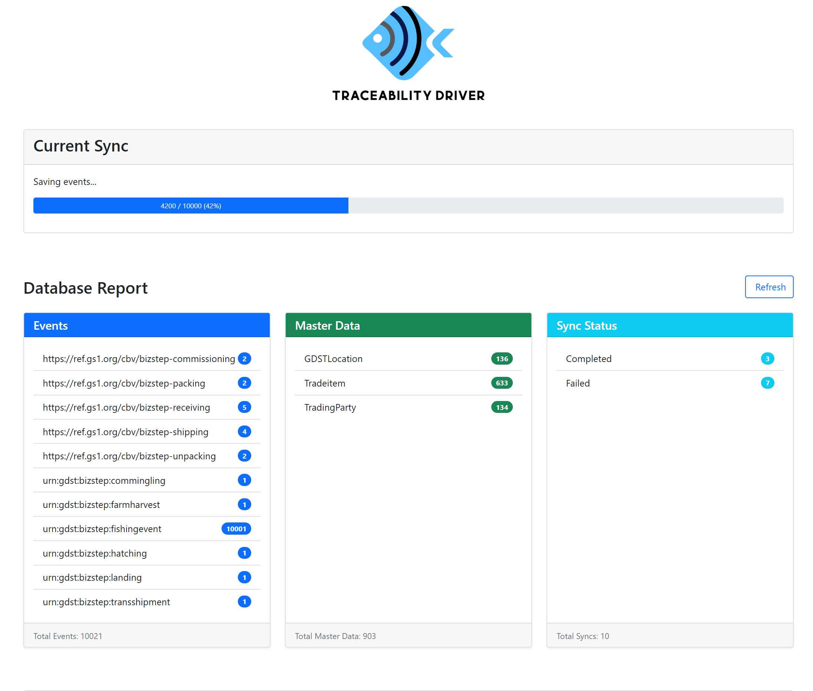
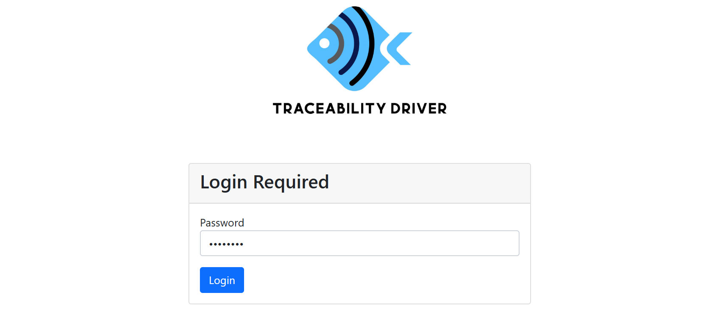
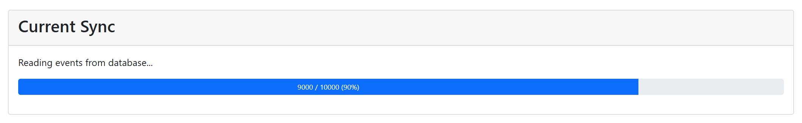
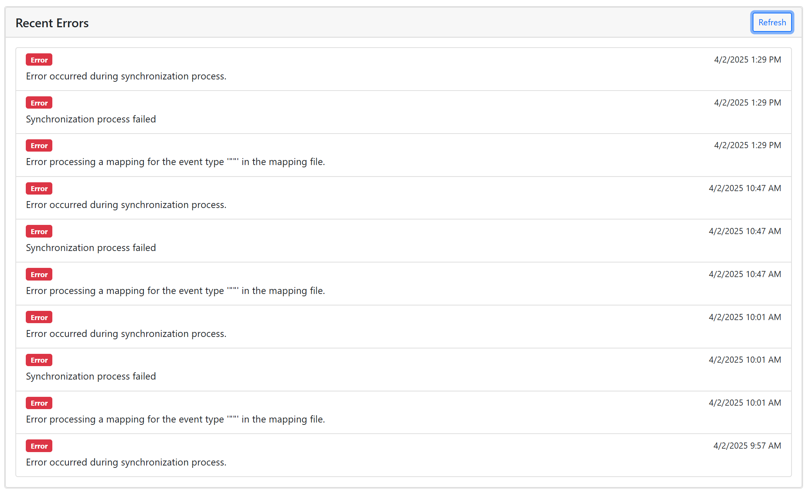
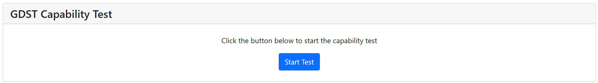
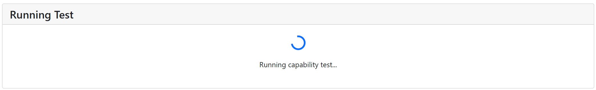
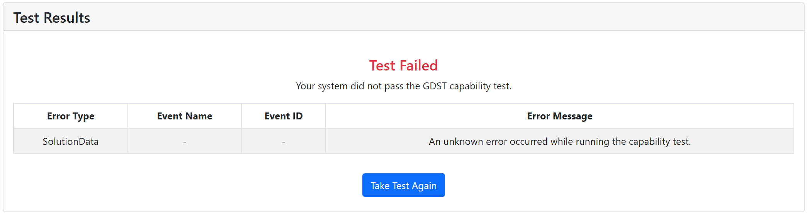
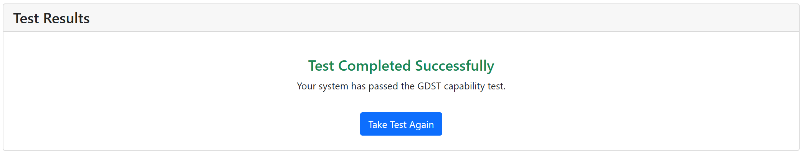

The Traceability Driver is a free open-source software tool that can be used to help reduce the costs of making a traceability solution interoperable. 
It is a standalone module that can be installed into an existing software system to expose traceability data using the GDST module.

# How does it work?
The Traceability Driver works by mapping data in an existing database into GDST events and master data.
The GDST events and master data are then saved into a seperate database called the GDST Data Cache.
The GDST Data Cache can then be queried using the GDST Communication Protocol.



## GDST Data Cache
The **GDST Data Cache** is where the traceability is stored.
It serves as the data source for API queries. 
By default, the GDST Data Cache built using MongoDB, but it can be configured to use other databases such as SQL Server, MySQL, or PostgreSQL.

> The Traceability Drvier is designed to be able to be extended to use other databases as the GDST Data Cache by re-implementing the `IDatabaseService` interface.

## Synchronization
Synchronizing the data between the existing software system and the Traceability Driver is done by using a database connection. 
Every minute, the Traceability Driver will sync up to 10,000 records from the database. Memory variables are used to keep track of where the last sync left off.

The synchronization process involves the  following steps:
- Upon start up, the synchronization will execute automatically.
- The synchronization will load all mappings found in the local `Mappings` folder of the executing directory.
- The synchronization will execute each mapping in the order that they are found in the `Mappings` folder.
- The traceability data is stored into the `GDST Data Cache`.
- The Traceability Driver will wait 1 minute before attempting to synchronize again.



> Important to know that currently it will only read up to 10,000 records from each selector statement. 
You must use the memory variables to remember where it last left off and then continue from there.

# Dashboard
There is a dashboard landing page that can be viewed that gives some visual insight to the current state, stats, errors.
The GDST capability test can also be executed from the dashboard.



The password for the dashboard is configured in the `appsettings.json` or an environment variable. The default password is `changeme`.

```json
"Authentication": {
    "Password": "changeme"
}
```

> This password only grants access to the dashboard and nothing else. Authentication for API access is configured separately.

**Login Page**


## Current Sync
Here the user is able to see the status of anything currently syncing.



## Database Report
Here you can see some basic stats such as the number of events, master data, and syncs.


## Errors
Here you can see the last 10 errors that have occurred during the sync process.



# Installation
The driver can be installed as a release or docker image.

## Docker Installation
The base image of the Traceability Driver does not contain any mappings.
To configure the driver for your environment, you will need to create a docker file that uses the 
Traceability Driver base image and copies your mapping files to the app/Mappings folder in the container.

```dockerfile
# Use the public image as the base
FROM iftgftc/traceability-driver:latest

# Copy your mapping folder into the container
COPY relative/path/to/your/mappings/folder/ /app/Mappings/

# The entrypoint/command from the base image will run automatically unless overridden
```

**The docker installation of the Traceability Driver is intended to be deployed behind a reverse proxy that 
handles SSL and HTTPS redirection.** Otherwise, a certificate for the Traceability Driver must be created and mounted to the container along with the relevant environment variables.

```yaml
- ASPNETCORE_URLS = https://+:443;http://+:80
- ASPNETCORE_Kestrel__Certificates__Default__Password=<certificate-password>
- ASPNETCORE_Kestrel__Certificates__Default__Path =/<path-to-your-certificate-file>/aspnetapp.pfx
```

## Release Installation
Go to the official releases page of the GitHub and download the latest release of the Traceability Driver. The Traceability Driver is a standalone module that can be installed into an existing software system and hosted on Windows or Linux servers.

1. Download the latest release of the Traceability Driver.
1. Install the Traceability Driver on a Windows or Linux server.
1. Configure the Traceability Driver by editing the `appsettings.json` file.
1. Create the mappings for the events that are being extracted from the database and place those in the `Mappings` folder.
1. Start the Traceability Driver and let it synchronize the data.
1. Navigate to the root URL of the Traceability Driver to see information about the current sync, previous syncs, and data that has been stored in the `GDST Data Cache`.

# Configuration
The Traceability Driver is configured using environment variables.
These environment variables can be configured within a docker compose file for local development, or in a cloud environment where the container is deployed.

## Local Development
A docker compose file is recommended for local development.

When using a docker compose file, the TD_MAPPINGS_FOLDER environment variable must be set to the location of the mappings folder on the host machine. 
A corresponding mount point must be set in the docker compose file to mount the mappings folder into the container.
```yaml
volumes:
    - ${TD_MAPPINGS_FOLDER}:/app/Mappings
```

### Docker Compose File Examples
**Mongo, no Auth**
```yaml
services:
    traceabilitydriver:
        image: iftgftc/traceability-driver:latest
        environment:
        - ASPNETCORE_ENVIRONMENT=Release
        - ASPNETCORE_HTTP_PORTS=8080
        - URL=https://localhost:58950
        - MongoDB__ConnectionString=<your-connectionstring>
        - MongoDB__DatabaseName=TraceabilityDriverTests
        - DISABLE_HTTPS_REDIRECTION=TRUE
        ports:
            - "80:8080"
        volumes:
            - ${TD_MAPPINGS_FOLDER}:/app/Mappings
        
```

**Mongo, with API Key Auth**
```yaml
services:
    traceabilitydriver:
        image: iftgftc/traceability-driver:latest
        environment:
        - ASPNETCORE_ENVIRONMENT=Release
        - ASPNETCORE_HTTP_PORTS=8080
        - URL=https://localhost:58950
        - MongoDB__ConnectionString=<your-connectionstring>
        - MongoDB__DatabaseName=TraceabilityDriverTests
        - DISABLE_HTTPS_REDIRECTION=TRUE
        - Authentication__APIKey__HeaderName=X-API-KEY
        - Authentication__APIKey__ValidKeys__0=test
        - Authentication__APIKey__ValidKeys__1=test_2
        ports:
            - "80:8080"
        volumes:
            - ${TD_MAPPINGS_FOLDER}:/app/Mappings
        
```

**Mongo, with OAuth**
```yaml
services:
    traceabilitydriver:
        image: iftgftc/traceability-driver:latest
        environment:
        - ASPNETCORE_ENVIRONMENT=Release
        - ASPNETCORE_HTTP_PORTS=8080
        - URL=https://localhost:58950
        - MongoDB__ConnectionString=<your-connectionstring>
        - MongoDB__DatabaseName=TraceabilityDriverTests
        - DISABLE_HTTPS_REDIRECTION=TRUE
        - Authentication__JWT__Audience=<your-audience>
        - Authentication__JWT__Authority=<your authority>
        - Authentication__JWT__MetadataAddress=<your-metadata-address>
        ports:
            - "80:8080"
        volumes:
            - ${TD_MAPPINGS_FOLDER}:/app/Mappings
        
```

**SQL Server, No Auth**
```yaml
services:
    traceabilitydriver:
        image: iftgftc/traceability-driver:latest
        environment:
        - ASPNETCORE_ENVIRONMENT=Release
        - ASPNETCORE_HTTP_PORTS=8080
        - URL=https://localhost:58950
        - SqlServer__ConnectionString=<your-connection-string>
        - DISABLE_HTTPS_REDIRECTION=TRUE
        ports:
            - "80:8080"
        volumes:
            - ${TD_MAPPINGS_FOLDER}:/app/Mappings
        
```

## Configuration Variables
### Mongo
The Traceability Driver uses MongoDB as the default database for the GDST Data Cache.
To configure the MongoDB connection, you need to configure the connection string.
Additionally, the database name and collection names can be configured.
```json
"MongoDB": {
    "ConnectionString": "<your-connection-string>",
    "DatabaseName": "TraceabilityDriverTests",
    "EventsCollectionName": "events",
    "MasterDataCollectionName": "masterdata",
    "SyncHistoryCollectionName": "synchistory",
    "LogCollectionName": "logs"
}
```

### SQL Server
The Traceability Driver can also be configured to use SQL Server as the database for the GDST Data Cache.
To configure the SQL Server connection, you need to configure the connection string.
```json
"SqlServer": {
    "ConnectionString": "<your-connection-string>",
}
```

> The Traceability Driver will default to using MongoDB if a MongoDB connection string is provided.
To use SQL Server, you must only provide a SQL Server connection string and not a MongoDB connection string.

### URL
Defines the URL where the API will be hosted. This must be configured correctly or the GDST Capability Test will fail.

**Example URL Configuration**
```json
"URL": "http://localhost:5000"
```

### GDST Capability Test
The Traceability Driver supports executing the capability test from the Traceability Driver portal. 
In order to do this, you must configure the `GDST Capability Test` section with the following fields:

- **Url** - The URL of the GDST Capability Test.
- **ApiKey** - The API key assigned to you as a solution provider by the capability tool.
- **SolutionName** - The name of the solution that is being tested. This must match the name of the solution in the capability tool exactly.
- **PGLN** - The PGLN of the solution that is being tested.

**Example GDST Capability Test Configuration**
```json
"GDST": {
    "CapabilityTest": {
        "Url": "https://capabilitytool-beta-app.azurewebsites.net/",
        "ApiKey": "************************************",
        "SolutionName": "TraceabilityDriver",
        "PGLN": "urn:gdst:example.org:party:TraceabilityDriver.001"
    }
},
```

> You need to reach out to [info@thegdst.org](info@thegdst.org) to get your credentials for executing the capability test.

After configuration, follow these steps to execute the capability test from inside the Traceability Driver portal:

**Start Capability Test**


**Running Capability Test**


**Capability Test Failed (with Errors)**


**Capability Test Success**


> The Traceability Driver has the capability to execute the capability test from the portal. 
This is useful for testing that the Traceability Driver is interoperable with other GDST capable systems. 
However, this does not indicate that traceability data is being synchronized correctly or that the traceability data is complete with all the GDST CTEs and KDEs.

### Identifiers
The Traceability Driver is capable of automatically generating traceability identifiers such as the EPC, GTIN, PGLN, and/or GLN. 
A critical part of generating these identifiers has to do with the domain that is generating them as is outlined in the [GDST URN specification](https://www.iana.org/assignments/urn-formal/gdst).

In order to configure this, you need to define the `Traceability:IdentifierDomain` in the `appsettings.json` file. The `Traceability:IdentifierDomain` are used to generate the identifiers for the traceability data.

```json
"Traceability": {
    "IdentifierDomain": "example.org"
}
```

The domain should be the domain site of the organization that is generating the traceability data. This domain is used to generate the URN for the traceability data.

### Authorization
The Traceability Driver allows for three modes of authentication:
- **OAuth (JWT) Authentication** - Allows for configuring OAuth authentication to the API using self-signed tokens.
- **API Key Authentication** - Allows for configuring API key authentication to the API which is required by GDST 1.2 communication protocol.
- **No Authentication** - If neither an API Key or OAuth authentication is present in the configuration, then no authentication is required to access the API.

#### OAuth (JWT) Authentication
The OAuth (JWT) authentication is used to authenticate the API using self-signed tokens. The authentication is configured in the `appsettings.json` file of the installation.

- **Token Issuer** - The token issuer is the OAuth provider that is used to authenticate the API.
- **Audience** - The audience is the intended audience of the token.
- **Metadata Address** - The metadata address is the JWKS discovery endpoint that is used to validate the token.
- **Require HTTPS Metadata** - This is used to require HTTPS for the metadata address.

**Example OAuth (JWT) Configuration**
```json
"Authentication": {
    "JWT": {
        "Authority": "https://your-oauth-provider.com",    
        "Audience": "your-api-identifier",                 
        "MetadataAddress": "https://your-oauth-provider.com/.well-known/openid-configuration", 
        "RequireHttpsMetadata": true       
     }
  },
```

#### API Key Authentication
API Key authentication is used to grant access to the controllers and the API keys are defined in the `appsettings.json` file.

**Example API Key Configuration**
```json
"Authentication": {
    "APIKey": {
        "HeaderName": "X-API-Key",
        "ValidKeys": [                     
          "key1-abc123",
          "key2-xyz789"
        ]
    }
}
```

## Mappings
The Traceability Driver targets individual events from the database and maps them into the Common Event Model.
Mapping files are used to define how to connect to the source database, how to query for the relevant data, and how to map the data to GDST CTEs and KDEs.

Mappings are defined in the `Mappings` folder of the installation.
> The base image of the traceability driver does not have any mappings. 
You must either build a new docker image from the base image and copy the mappings to the `Mappings` folder of the base image or otherwise mount your mappings folder to the `Mappings` folder of the base image.

Each event type that is being extracted, transformed, and loaded into the GDST module should have its own mapping file.
The mapping is defined by using the following fields:

- `Id` - A unique identifier for the mapping.
- `Selectors` - An array of selectors that are used to select the data from the database.
- `EventMapping` - The mapping of the data from the database into the Common Event Model.

### Mapping Selectors
The mapping selectors are used to select the data from the database. The selectors are defined by using the following fields:

- `Id` - A unique identifier for the selector.
- `Database` - The database that the selector is used to select the data from.
- `Count` - The SQL statement that is used to count the number of records that will be returned by the selector.
- `Selector` - The SQL statement that is used to select the data from the database.
- `Memory` - This can be used to capture information from the database and store it to be accessed by the next sync cycle.

One or more selectors can be defined for each event mapping such that the event's information is pieced together from multiple tables in the database or even multiple tables from multiple databases.

When using multiple selectors, values are kept in order of priority, such that if the value for a field in the Common Event Model is found in the first selector, this value will be priororized for the event over the value found in future selectors for the same event.

**Example Selector**
```json
{
    "Id": "SAMPLE_EventSelector",
    "Database": "SAMPLE_DB",
    "Count": "SELECT COUNT(*) FROM [sample].[dbo].[EventRecords] WHERE weightUnit = 'kg' AND eventType = 'E' AND category = 'EXAMPLE'",
    "Selector": "SELECT evt.idRecord, evt.idEventRecord, evt.operatorId, evt.operatorFirstName, evt.operatorLastName, evt.vehicleId, evt.vehicleName, veh.Country as vehicleCountry, evt.authCode, evt.eventStart, evt.equipmentType, evt.itemName, evt.itemWeight, evt.weightUnit, evt.itemScientificName FROM [sample].[dbo].[EventRecords] evt INNER JOIN dbo.Vehicles veh ON veh.IdVehicle = evt.idVehicle WHERE weightUnit = 'kg' AND eventType = 'E' AND category = 'EXAMPLE' AND evt.idEventRecord > @LastID ORDER BY idRecord ASC OFFSET @offset ROWS FETCH NEXT @limit ROWS ONLY;",
    "Memory": { ... }
}
```

#### Selector Memory
The `Memory` field is used to capture information from the database and store it to be accessed by the next sync cycle. This can be used to store information that is needed to be accessed by the next selector in the mapping such as where we last left off when syncing.

- `LastID` - This is the name of the memory variable that is stored.
    - `DefaultValue` - The default value for the memory variable.
    - `Field` - The field that is stored in the memory variable from the selector results.
    - `Type` - The data type of the memory variable which can be `Int32`, `Int64`, `String`, `DateTime`, or `Boolean`.

The field value stored is always the value from the field from the last row processed in the previoused sync.

```json
"Memory": {
    "LastID": {
        "DefaultValue": "0",
        "Field": "$idEventRecord",
        "Type": "Int64"
    }
},
```

For example, the `LastID` memory variable is used to store the maximum `idEventRecord` value from the selector results. This value is then used in the next selector to determine where to start the next synchronization cycle.

### Event Mapping
The event mapping is a JSON object that uses a Common Event Model with mapping fields that are used to map the data from the database into the Common Event Model.

The field values are defined in a way such that they can be used to extract values from the database and map them into the Common Event Model.

#### Mapping Field Values
The mapping field values are defined by using the following syntax:

- **Static Values** - Static values are defined by using the `!` character followed by the value.
- **Field Values** - Field values are defined by using the `$` character followed by the field name.
- **Functions** - Functions are defined by using the function name and the parameters. The function name is followed by the parameters in parentheses.

#### Common Event Model
The common event model is a simplified data model that the data from the database is mapped into. The Traceability Driver then builds up the traceability data using the Common Event Model after which it is then transformed into EPCIS data and stored in the `GDST Data Cache`.

The common event model is defined by using the following fields:
- `EventId` - The unique identifier for the event.
- `EventType` - The type of event.
- `EventTime` - The time of the event.
- `InformationProvider` - The information provider of the event.
    - `OwnerId` - The unique identifier for the information provider.
    - `Name` - The name of the information provider.
- `ProductOwner` - The product owner of the event.
    - `OwnerId` - The unique identifier for the product owner.
    - `Name` - The name of the product owner.
- `Location` - The location of the event.
    - `LocationId` - The unique identifier for the location.
    - `OwnerId` - The unique identifier for the location owner.
    - `RegistrationNumber` - The registration number of the location.
    - `Name` - The name of the location.
    - `Country` - The country of the location.
- `Products` - The products of the event.
    - `ProductId` - The unique identifier for the product.
    - `ProductType` - This indicates the type of the reference to the product and can be either `Reference`, `Input`, `Output`, `Child`, or `Parent`.
    - `LotNumber` - The lot number of the product.
    - `Quantity` - The quantity of the product.
    - `UoM` - The unit of measure of the product.
    - `ProductDefinition` - The product definition of the product.
        - `ProductDefinitionId` - The unique identifier for the product definition. This should either be the GTIN in the required URN format from EPCIS, or it should be a unique identifier for the product definition. If the value is not a GTIN, then a valid GTIN will be generated for the product definition using the `ProductDefinitionId` and the `OwnerId`.
        - `OwnerId` - The unique identifier for the product definition owner.
        - `ShortDescription` - The short description of the product definition.
        - `ProductForm` - The product form of the product definition.
        - `ScientificName` - The scientific name of the product definition.
- `CatchInformation` - The catch information of the event.
    - `CatchArea` - The catch area of the event.
    - `GearType` - The gear type of the event.
    - `GPSAvailable` - The GPS availability of the event.
- `Certificates` - The certificates of the event.
    - `FishingAuthorization` - The fishing authorization certificate of the event.
        - `Identifier` - The identifier of the authorization certificate.

#### Event ID
The `EventId` field is used as a unique identifier for the event such that events are merged together on common `EventId` values. When saving to the database, the `EventId` is used as the primary key for the event.

For instance:
- If an existing event is found with the same `EventId`, the event is updated with the new values when saving into the `GDST Data Cache`.
- If the same or multiple selector(s) returns two rows with the same `EventId`, the event is merged together into a single event with the same `EventId`. Values are kept in order of priority, such that if the value for a field in the Common Event Model is found in the first selector, this value will be priororized for the event over the value found in future selectors for the same event.

It is important that the `EventId` is unique for each event such that events are not duplicated in the `GDST Data Cache`.

#### Example Mapping
```
{
    "Mappings": [
            {
                "Id": "SAMPLE",
                "Selectors": [
                    {
                        "Id": "SAMPLE_EventSelector",
                        "Database": "SAMPLE_DB",
                        "Count": "SELECT COUNT(*) FROM [sample].[dbo].[EventRecords] WHERE weightUnit = 'kg' AND eventType = 'E' AND category = 'EXAMPLE'",
                        "Selector": "SELECT evt.idRecord, evt.idEventRecord, evt.operatorId, evt.operatorFirstName, evt.operatorLastName, evt.vehicleId, evt.vehicleName, veh.Country as vehicleCountry, evt.authCode, evt.eventStart, evt.equipmentType, evt.itemName, evt.itemWeight, evt.weightUnit, evt.itemScientificName FROM [sample].[dbo].[EventRecords] evt INNER JOIN dbo.Vehicles veh ON veh.IdVehicle = evt.idVehicle WHERE weightUnit = 'kg' AND eventType = 'E' AND category = 'EXAMPLE' ORDER BY idRecord ASC OFFSET @offset ROWS FETCH NEXT @limit ROWS ONLY;",
                        "EventMapping": {
                            "EventId": "$idEventRecord",
                            "EventType": "!GenericEvent",
                            "EventTime": "$eventStart",
                            "InformationProvider": {
                                "OwnerId": "GenerateIdentifier(!IDOP, $operatorId)",
                                "Name": "Join( ,$operatorFirstName,$operatorLastName)"
                            },
                            "ProductOwner": {
                                "OwnerId": "GenerateIdentifier(!IDOP, $operatorId)",
                                "Name": "Join( ,$operatorFirstName,$operatorLastName)"
                            },
                            "Location": {
                                "LocationId": "GenerateIdentifier(!VLOC, $operatorId)",
                                "OwnerId": "GenerateIdentifier(!IDOP, $operatorId)",
                                "RegistrationNumber": "$vehicleId",
                                "Name": "$vehicleName",
                                "Country": "$vehicleCountry"
                            },
                            "Products": [
                                {
                                    "ProductId": "GenerateIdentifier(!ITEMPROD, $operatorId, $eventStart, $itemScientificName)",
                                    "LotNumber": "GenerateIdentifier(!ITEMLOT, $operatorId, $eventStart)",
                                    "Quantity": "$itemWeight",
                                    "UoM": "!KGM",
                                    "ProductDefinition": {
                                        "ProductDefinitionId": "GenerateIdentifier(!ITEMDEF, $operatorId, $itemScientificName)",
                                        "OwnerId": "GenerateIdentifier(!IDOP, $operatorId)",
                                        "ShortDescription": "$itemName",
                                        "ProductForm": "!RAW",
                                        "ScientificName": "$itemScientificName"
                                    }
                                }
                            ],
                            "CatchInformation": {
                                "CatchArea": "!urn:example:area:01",
                                "GearType": "Dictionary($equipmentType, EquipmentType)",
                                "GPSAvailable": "!true"
                            },
                            "Certificates": {
                                "FishingAuthorization": {
                                    "Identifier": "$authCode"
                                }
                            }
                        }
                    }
                ]
            }
        ],
    "Dictionaries": { ... }",
    "Connections": { ... }"
}
```

### Event Mapping Functions
The event mapping functions are used to transform the data from the database into the Common Event Model. The functions are defined by using the following syntax:

- **GenerateIdentifier** - Generates a unique identifier for the field.
- **Join** - Joins the values of the fields together.
- **Dictionary** - Transforms the value of the field using a dictionary.

#### Generate Identifier
The `GenerateIdentifier` function is used to create unique identifiers for various elements in the traceability system. It takes multiple parameters and creates a standardized identifier by:

1. Stripping all non-alphanumeric characters from each parameter value
2. Concatenating the values together with hyphens

**Syntax:**
```
GenerateIdentifier(prefix, value1, value2, ...)
```

- **prefix** - A static value that indicates the type of identifier being created (e.g., `!IDOP` for operators, `!VLOC` for vessel locations)
- **value1, value2, ...** - One or more values from the database that will be combined to create a unique identifier

**Example:**
```json
"OwnerId": "GenerateIdentifier(!IDOP, $operatorId)",
"LocationId": "GenerateIdentifier(!VLOC, $vehicleId)",
"ProductId": "GenerateIdentifier(!ITEMPROD, $operatorId, $eventStart, $itemScientificName)"
```

In these examples:
- An operator ID might be generated as `IDOP-12345` where 12345 is the operatorId
- A location ID might be generated as `VLOC-V789` where V789 is the vehicleId
- A product ID might combine an operator ID, event time, and scientific name to create a unique identifier

The function ensures that all identifiers follow a consistent format by removing special characters that might cause issues in data processing or storage.

#### Join
The `Join` function concatenates multiple field values together using a specified separator. This is particularly useful for combining multiple database fields into a single value, such as creating a full name from first name and last name fields.

**Syntax:**
```
Join(separator, value1, value2, ...)
```

- **separator** - The character(s) used to join the values together
- **value1, value2, ...** - The values to be joined

The function ignores any null values when joining the fields.

**Example:**
```json
"Name": "Join( ,$operatorFirstName,$operatorLastName)"
```

In this example:
- If `$operatorFirstName` is "John" and `$operatorLastName` is "Doe", the result will be "John Doe"
- If `$operatorFirstName` is null and `$operatorLastName` is "Doe", the result will be "Doe"
- If both values are null, the result will be null

The Join function is particularly useful for creating human-readable display names or for combining multiple fields into a standardized format.

#### Dictionaries
The dictionaries are used to transform the values of the fields using a dictionary. The dictionary is defined in the configuration file and then referenced in the mapping file.

##### Dictionary Configuration
Dictionaries are configured in the `Dictionaries` section in the mapping configuration file. Each dictionary is a key-value pair collection where the key is the value from the database and the value is what it should be transformed into.

**Example Dictionary Configuration**
```json
{
    "Mappings": [ ... ],
    "Dictionaries": {
        "FishingGearType": {
            "GEAR1": "urn:gdst:gear:1.1",
            "GEAR9_9": "urn:gdst:gear:9.9",
            "GEAR8_9": "urn:gdst:gear:8.9"
        }
    },
    "Connections": { ... }
}
```

##### Using the Dictionary Function
The dictionary function is used in the mapping file to transform values from the database using the configured dictionaries. The function takes two parameters:
1. The value to look up in the dictionary
2. The name of the dictionary to use for the lookup

If the value is found in the specified dictionary, the function returns the corresponding transformed value. If the value is not found, the function returns null.

**Example Usage**
```json
"CatchInformation": {
  "CatchArea": "!urn:example:area:01",
  "GearType": "Dictionary($equipmentType, EquipmentType)",
  "GPSAvailable": "!true"
}
```

In this example:
- If `$equipmentType` has a value of "TR", the `GearType` will be set to "urn:gdst:fishing-gear:trolling-lines"

If the value from the database doesn't exist in the dictionary, the field will be set to null in the resulting event.