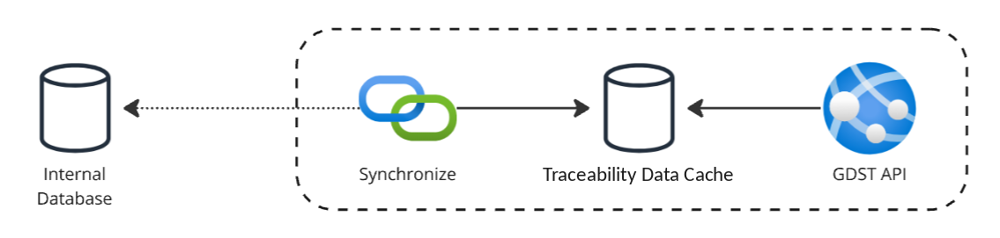
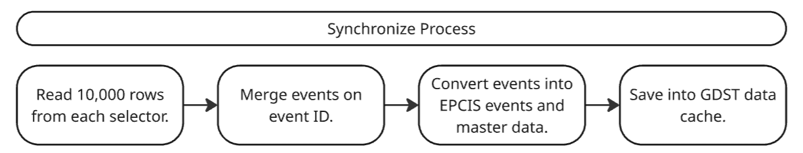
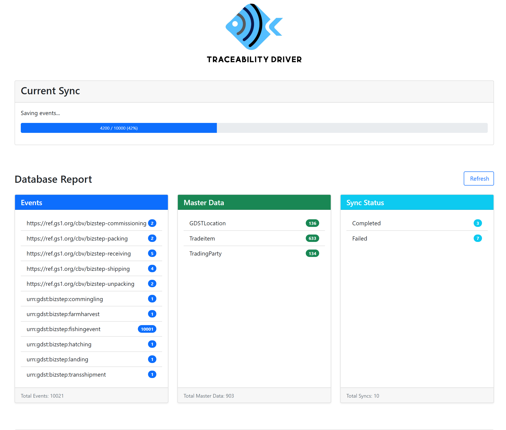
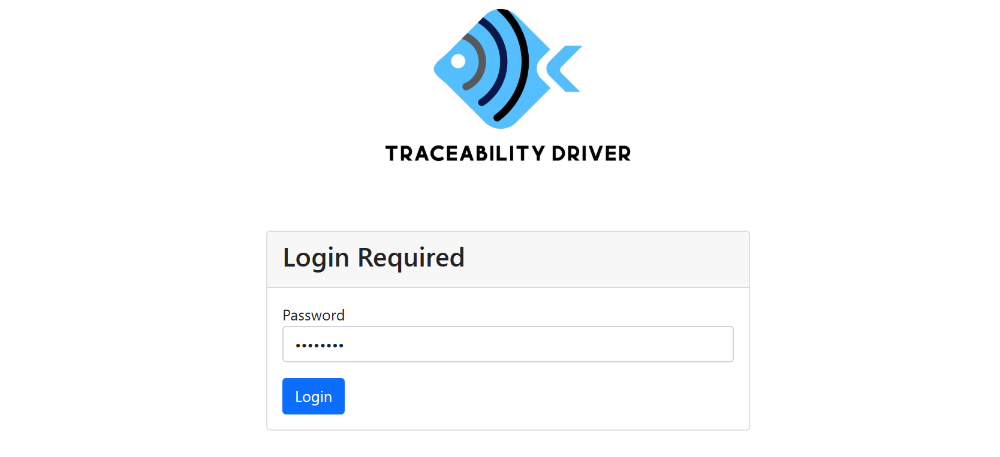
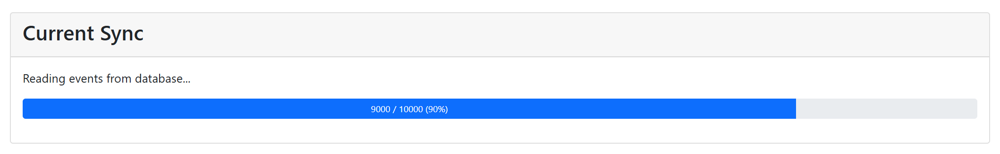
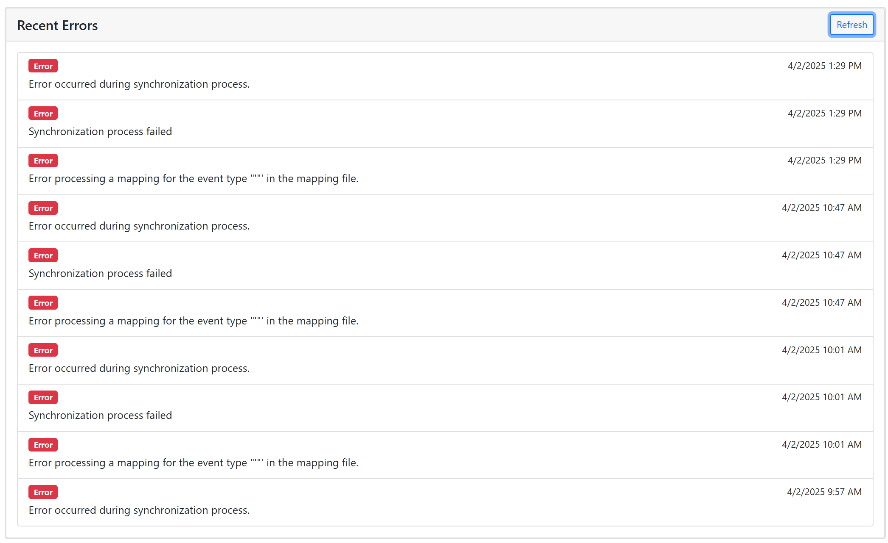
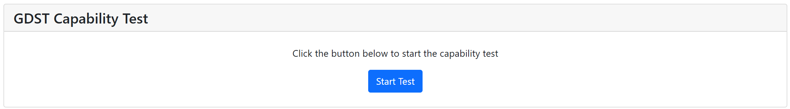
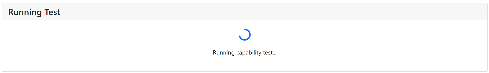
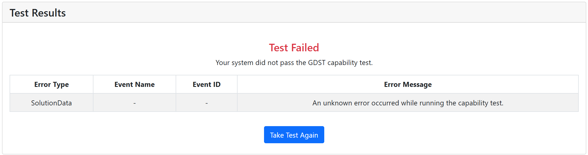
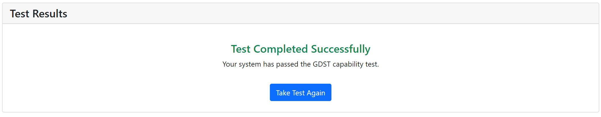

# What Is The Traceability Driver?

The Traceability Driver is a free, open-source tool that lowers the cost of making your supply chain traceability data interoperable. 
It installs alongside your existing software as a standalone module without any changes to your current systems, reads data from your existing database, translates it into 
a standardized format, and exposes it through an API that partners, auditors, and certifiers can query.

The Driver is **commodity-agnostic**: the same mapping engine works for any supply chain, such as beef, leather, seafood, and beyond. You define how your data is read, 
and the Driver handles the transation.

## Key features

- **Commodity-agnostic**: one engine for any product or industry; you control the  mapping, the engine stays neutral about what is being traced.
- **Non-intrusive**: runs beside your existing system with no changes to your  source database or application.
- **Open source and free**: no licensing costs.
- **Standards support**: outputs industry-neutral GS1 EPCIS events, with optional GDST (Global Dialogue on Seafood Traceability) and MSC (Marine Stewardship Council) extensions.
- **Configurable storage**: stores traceability data in a separate cache, using MongoDB by default or MSSQL Server.
- **Extensible Adapters**: pre-built adapters for syncing with MSSQL Server, MySQL, or PostGreSQL server. Additional adapaters are easy to implment with the `ITDConnector` interface.
- **Automatic synchronization**: keeps the cache up to date by syncing from your database on a schedule.
- **Flexible authentication**: secure the API with OAuth (JWT) or API keys, or run with no authentication.
- **Built-in dashboard**: monitor sync status, view stats and errors, and run the GDST capability test.

# How Does It Work?

The Driver follows a simple three-stage flow: it **reads** records from your existing database, **maps** them into standardized events and master data, and **stores** the
result in a separate database, the Traceability Data Cache, which your partners can query through the Global Traceability Framework Communication Protocol based on EPCIS.



## Traceability Data Cache

The Traceability Data Cache is where the standardized traceability data is stored, and it is the source for all API queries. The cache uses MongoDB by default, but can be configured
to use MSSQL Server.

> Support for other database types can be added by implementing the `IDatabaseService` interface.

## Synchronization

The Driver keeps the cache up to date by syncing from your database using an `ITDConnector` database connection. The process runs on a loop:

1. On startup, synchronization begins automatically.
2. The Driver loads every mapping in the local `Mappings` folder.
3. It runs each mapping in the order the files appear in the folder.
4. The resulting data is written to the cache.
5. The Driver waits one minute, then begins the next cycle.



> Each selector reads at most 10,000 records per cycle, so larger tables are processed across multiple cycles. Memory variables record where the last cycle stopped so the
next one continues from that point, these are covered in detail under Mappings.

# Dashboard

The Driver includes a dashboard landing page that gives a visual overview of the current sync state, basic stats, and recent errors. You can also run the GDST
capability test directly from the dashboard.



The dashboard is protected by a password, set in `appsettings.json` or through an environment variable. The default is `changeme`.

```json
"Authentication": {
    "Password": "changeme"
}
```

> This password only grants access to the dashboard. API access is authenticated separately (see Authorization).

**Login Page**


## Current Sync

Shows the status of any synchronization currently in progress.



## Database Report

Shows basic stats, such as the number of events, master data records, and syncs.


## Errors

Shows the last 10 errors that occurred during synchronization.



# Installation

The driver can be installed as a Docker image.

## Docker Installation

The base image of the Traceability Driver does not contain any mappings.
To configure the driver for your environment, you will need to create a **Dockerfile** that uses the Driver base image and copies your mapping files to the app/Mappings folder in the container.

```dockerfile
# Use the public image as the base
FROM iftgftc/traceability-driver:latest

# Copy your mapping folder into the container
COPY relative/path/to/your/mappings/folder/ /app/Mappings/

# The entrypoint/command from the base image will run automatically unless overridden
```

**The Docker installation of the Driver is intended to be deployed behind a reverse proxy that 
handles SSL and HTTPS redirection.** Otherwise, a certificate for the Driver must be created and mounted to the container along with the relevant environment variables.

```yaml
- ASPNETCORE_URLS=https://+:443;http://+:80
- ASPNETCORE_Kestrel__Certificates__Default__Password=<certificate-password>
- ASPNETCORE_Kestrel__Certificates__Default__Path=/<path-to-your-certificate-file>/aspnetapp.pfx
```

# Configuration

The Driver is configured using environment variables.
These environment variables can be configured within a Docker Compose file for local development or in a cloud environment where the container is deployed.

## Local Development

A Docker Compose file is recommended for local development.

When using a Docker Compose file, the TD_MAPPINGS_FOLDER environment variable must be set to the location of the mappings folder on the host machine. 
A corresponding mount point must be set in the Docker Compose file to mount the mappings folder into the container.
```yaml
volumes:
    - ${TD_MAPPINGS_FOLDER}:/app/Mappings
```

### Docker Compose File Examples

**Mongo, no Auth**
```yaml
services:
    traceabilitydriver:
        image: iftgftc/traceability-driver:latest
        environment:
        - ASPNETCORE_ENVIRONMENT=Release
        - ASPNETCORE_HTTP_PORTS=8080
        - URL=https://localhost:58950
        - MongoDB__ConnectionString=<your-connectionstring>
        - MongoDB__DatabaseName=TraceabilityDriverTests
        - DISABLE_HTTPS_REDIRECTION=TRUE
        ports:
            - "80:8080"
        volumes:
            - ${TD_MAPPINGS_FOLDER}:/app/Mappings
        
```

**Mongo, with API Key Auth**
```yaml
services:
    traceabilitydriver:
        image: iftgftc/traceability-driver:latest
        environment:
        - ASPNETCORE_ENVIRONMENT=Release
        - ASPNETCORE_HTTP_PORTS=8080
        - URL=https://localhost:58950
        - MongoDB__ConnectionString=<your-connectionstring>
        - MongoDB__DatabaseName=TraceabilityDriverTests
        - DISABLE_HTTPS_REDIRECTION=TRUE
        - Authentication__APIKey__HeaderName=X-API-Key
        - Authentication__APIKey__ValidKeys__0=test
        - Authentication__APIKey__ValidKeys__1=test_2
        ports:
            - "80:8080"
        volumes:
            - ${TD_MAPPINGS_FOLDER}:/app/Mappings
        
```

**Mongo, with OAuth**
```yaml
services:
    traceabilitydriver:
        image: iftgftc/traceability-driver:latest
        environment:
        - ASPNETCORE_ENVIRONMENT=Release
        - ASPNETCORE_HTTP_PORTS=8080
        - URL=https://localhost:58950
        - MongoDB__ConnectionString=<your-connectionstring>
        - MongoDB__DatabaseName=TraceabilityDriverTests
        - DISABLE_HTTPS_REDIRECTION=TRUE
        - Authentication__JWT__Audience=<your-audience>
        - Authentication__JWT__Authority=<your-authority>
        - Authentication__JWT__MetadataAddress=<your-metadata-address>
        ports:
            - "80:8080"
        volumes:
            - ${TD_MAPPINGS_FOLDER}:/app/Mappings
        
```

**SQL Server, No Auth**
```yaml
services:
    traceabilitydriver:
        image: iftgftc/traceability-driver:latest
        environment:
        - ASPNETCORE_ENVIRONMENT=Release
        - ASPNETCORE_HTTP_PORTS=8080
        - URL=https://localhost:58950
        - SqlServer__ConnectionString=<your-connection-string>
        - DISABLE_HTTPS_REDIRECTION=TRUE
        ports:
            - "80:8080"
        volumes:
            - ${TD_MAPPINGS_FOLDER}:/app/Mappings
        
```

## Configuration Variables

### Mongo

The Traceability Driver uses MongoDB as the default database for the Traceability Data Cache.
To configure the MongoDB connection, you need to configure the connection string.
Additionally, the database name and collection names can be configured.

```json
"MongoDB": {
    "ConnectionString": "<your-connection-string>",
    "DatabaseName": "TraceabilityDriverTests",
    "EventsCollectionName": "events",
    "MasterDataCollectionName": "masterdata",
    "SyncHistoryCollectionName": "synchistory",
    "LogCollectionName": "logs"
}
```

### SQL Server

The Driver can also be configured to use SQL Server as the database for the Traceability Data Cache.
To configure the SQL Server connection, you need to configure the connection string.

```json
"SqlServer": {
    "ConnectionString": "<your-connection-string>"
}
```

> The Driver will default to using MongoDB if a MongoDB connection string is provided.
To use SQL Server, you must only provide a SQL Server connection string and not a MongoDB connection string.

### URL

Defines the URL where the API will be hosted. This must be configured correctly or the GDST Capability Test will fail.

**Example URL Configuration**

```json
"URL": "http://localhost:5000"
```

### GDST Capability Test

The Driver supports executing the capability test from the Traceability Driver portal. 
In order to do this, you must configure the `GDST Capability Test` section with the following fields:

- **Url** - The URL of the GDST Capability Test.
- **ApiKey** - The API key assigned to you as a solution provider by the capability tool.
- **SolutionName** - The name of the solution that is being tested. This must match the name of the solution in the capability tool exactly.
- **PGLN** - The PGLN of the solution that is being tested.

**Example GDST Capability Test Configuration**

```json
"GDST": {
    "CapabilityTest": {
        "Url": "https://capabilitytool-beta-app.azurewebsites.net/",
        "ApiKey": "************************************",
        "SolutionName": "TraceabilityDriver",
        "PGLN": "urn:gdst:example.org:party:TraceabilityDriver.001"
    }
},
```

> You need to reach out to [info@thegdst.org](mailto:info@thegdst.org) to get your credentials for executing the capability test.

After configuration, follow these steps to execute the capability test from inside the Driver portal:

**Start Capability Test**


**Running Capability Test**


**Capability Test Failed (with Errors)**


**Capability Test Success**


> The Driver can run the capability test directly from the portal, which is useful for confirming interoperability with other GDST-capable systems. Note, 
however, that this does not mean your data is being synchronized correctly, or that it includes all the GDST CTEs and KDEs.

### MSC (Marine Stewardship Council) Extensions

The Driver supports mapping to the MSC CTE and KDE extensions provided by the `OpenTraceability.MSC` library. To enable these mappings, set the `EnableMSC` option
to `true` in the `appsettings.json` file.

```json
"EnableMSC": true
```

### Identifiers

The Driver can automatically generate traceability identifiers such as EPC, GTIN, PGLN, and GLN. A key factor in producing these identifiers is the domain that issues
them, as outlined in the [GDST URN specification](https://www.iana.org/assignments/urn-formal/gdst).

In order to configure this, you need to define the `Traceability:IdentifierDomain` in the `appsettings.json` file. The `Traceability:IdentifierDomain` is used to generate the identifiers for the traceability data.

```json
"Traceability": {
    "IdentifierDomain": "example.org"
}
```

The domain should be the domain site of the organization that is generating the traceability data. This domain is used to generate the URN for the traceability data.

### Authorization

The Traceability Driver allows for three modes of authentication:
- **OAuth (JWT) Authentication** - Allows for configuring OAuth authentication to the API using self-signed tokens.
- **API Key Authentication** - Allows for configuring API key authentication to the API which is required by GDST 1.2 communication protocol.
- **No Authentication** - If neither an API Key or OAuth authentication is present in the configuration, then no authentication is required to access the API.

#### OAuth (JWT) Authentication

The OAuth (JWT) authentication is used to authenticate the API using self-signed tokens. The authentication is configured in the `appsettings.json` file of the installation.

- **Token Issuer (Authority)** - The token issuer is the OAuth provider that is used to authenticate the API.
- **Audience** - The audience is the intended audience of the token.
- **Metadata Address** - The metadata address is the JWKS discovery endpoint that is used to validate the token.
- **Require HTTPS Metadata** - This is used to require HTTPS for the metadata address.

**Example OAuth (JWT) Configuration**

```json
"Authentication": {
    "JWT": {
        "Authority": "https://your-oauth-provider.com",    
        "Audience": "your-api-identifier",                 
        "MetadataAddress": "https://your-oauth-provider.com/.well-known/openid-configuration", 
        "RequireHttpsMetadata": true       
     }
  },
```

#### API Key Authentication

API Key authentication is used to grant access to the controllers and the API keys are defined in the `appsettings.json` file.

**Example API Key Configuration**

```json
"Authentication": {
    "APIKey": {
        "HeaderName": "X-API-Key",
        "ValidKeys": [                     
          "key1-abc123",
          "key2-xyz789"
        ]
    }
}
```

#### Traceback API Key Authentication

The traceback endpoints (`POST /traceback` and the traceback history queries) use their **own** key set, separate from the query API keys above. A query key can never trigger a traceback, and a traceback key can never query the EPCIS/master data endpoints. If no traceback keys are configured, the traceback endpoints return `401` until keys are added.

**Example Traceback API Key Configuration**

```json
"Authentication": {
    "TracebackAPIKey": {
        "HeaderName": "X-API-Key",
        "ValidKeys": [
          "traceback-key-abc123"
        ]
    }
}
```

## Tracebacks

A traceback pulls traceability data from an external GDST/EPCIS server into the local data cache. Send `POST /traceback` (authenticated with a traceback API key) with the EPCs to trace:

```json
{
    "epcs": [ "urn:epc:id:sgtin:..." ],
    "resolverUrl": "https://external-server.com/digitallink",
    "apiKey": "external-server-key"
}
```

`resolverUrl` is required; `apiKey` is optional and sent to the external server when supplied. The external server must implement version 1.2.0 of the GS1 Digital Link Resolver standard (linkset responses).

Every run is recorded, along with a ledger of every event and master data element it created or updated:

- `GET /traceback?top=100&skip=0` — traceback history, newest first.
- `GET /traceback/{id}` — a single traceback record with counts and errors.
- `GET /traceback/{id}/items` — the ledger of resources that run created/updated.

The driver only ingests into its own data cache and records what was ingested — it never writes to your internal database. Use the ledger to sync ingested data back into your own systems if you wish. Ingestion is idempotent: repeating a traceback over the same products updates the cached resources in place instead of duplicating them.

> **Note:** database schema updates are applied automatically at startup via EF Core migrations (SQL Server backend). Databases created by older versions are baselined and upgraded in place on first startup.

## Mappings

The Traceability Driver targets individual events from the database and maps them into the Common Event Model.
Mapping files are used to define how to connect to the source database, how to query for the relevant data, and how to map the data to GDST CTEs and KDEs.

Mappings are defined in the `Mappings` folder of the installation.
> The base image of the Driver does not have any mappings. 
You must either build a new Docker image from the base image and copy the mappings to the `Mappings` folder of the base image or otherwise mount your mappings folder to the `Mappings` folder of the base image.

Each event type that is being extracted, transformed, and loaded into the GDST module should have its own mapping file.
The mapping is defined by using the following fields:

- `Id` - A unique identifier for the mapping.
- `Selectors` - An array of selectors that are used to select the data from the database.
- `EventMapping` - The mapping of the data from the database into the Common Event Model.

### Mapping Selectors

The mapping selectors are used to select the data from the database. The selectors are defined by using the following fields:

- `Id` - A unique identifier for the selector.
- `Database` - The database that the selector is used to select the data from.
- `Count` - The SQL statement that is used to count the number of records that will be returned by the selector.
- `Selector` - The SQL statement that is used to select the data from the database.
- `Memory` - This can be used to capture information from the database and store it to be accessed by the next sync cycle.

One or more selectors can be defined for each event mapping such that the event's information is pieced together from multiple tables in the database or even multiple tables from multiple databases.

When using multiple selectors, values are kept in order of priority, such that if the value for a field in the Common Event Model is found in the first selector, this value will be prioritized for the event over the value found in future selectors for the same event.

**Example Selector**

```json
{
    "Id": "SAMPLE_EventSelector",
    "Database": "SAMPLE_DB",
    "Count": "SELECT COUNT(*) FROM [sample].[dbo].[EventRecords] WHERE weightUnit = 'kg' AND eventType = 'E' AND category = 'EXAMPLE'",
    "Selector": "SELECT evt.idRecord, evt.idEventRecord, evt.operatorId, evt.operatorFirstName, evt.operatorLastName, evt.vehicleId, evt.vehicleName, veh.Country as vehicleCountry, evt.authCode, evt.eventStart, evt.equipmentType, evt.itemName, evt.itemWeight, evt.weightUnit, evt.itemScientificName FROM [sample].[dbo].[EventRecords] evt INNER JOIN dbo.Vehicles veh ON veh.IdVehicle = evt.idVehicle WHERE weightUnit = 'kg' AND eventType = 'E' AND category = 'EXAMPLE' AND evt.idEventRecord > @LastID ORDER BY idRecord ASC OFFSET @offset ROWS FETCH NEXT @limit ROWS ONLY;",
    "Memory": { ... }
}
```

#### Selector Memory

The `Memory` field is used to capture information from the database and store it to be accessed by the next sync cycle. This can be used to store information that is needed to be accessed by the next selector in the mapping such as where we last left off when syncing.

- `LastID` - This is the name of the memory variable that is stored.
    - `DefaultValue` - The default value for the memory variable.
    - `Field` - The field that is stored in the memory variable from the selector results.
    - `DataType` - The data type of the memory variable which can be `Int32`, `Int64`, `String`, `DateTime`, or `Boolean`.

The field value stored is always the value from the field from the last row processed previous sync.

```json
"Memory": {
    "LastID": {
        "DefaultValue": "0",
        "Field": "$idEventRecord",
        "DataType": "Int64"
    }
},
```

For example, the `LastID` memory variable is used to store the maximum `idEventRecord` value from the selector results. This value is then used in the next selector to determine where to start the next synchronization cycle.

### Event Mapping

The event mapping is a JSON object that uses a Common Event Model with mapping fields that are used to map the data from the database into the Common Event Model.

The field values are defined in a way such that they can be used to extract values from the database and map them into the Common Event Model.

#### Mapping Field Values

The mapping field values are defined by using the following syntax:

- **Static Values** - Static values are defined by using the `!` character followed by the value.
- **Field Values** - Field values are defined by using the `$` character followed by the field name.
- **Functions** - Functions are defined by using the function name and the parameters. The function name is followed by the parameters in parentheses.

#### Common Event Model

The **`CommonEvent`** model defines the standard representation of an event within the Traceability Driver. It provides a normalized structure for mapping event data from diverse traceability systems.

The common event model is defined by the following fields:

- **`EventId`** The unique identifier for the event. Used to merge or correlate events.
- **`EventType`** The type of the event (e.g., `CatchEvent`, `LandingEvent`, `ShippingEvent`, etc.).
- **`EventTime`** The time of the event.
- **`HumanWelfarePolicy`** The human welfare policy associated with the event.
- **`InformationProvider`** The party providing information about the event.
  - **`OwnerId`**  The unique identifier for the information provider.
  - **`Name`**  The name of the information provider.
- **`ProductOwner`**  The party that owns the product at the time of the event.
  - **`OwnerId`**  The unique identifier for the product owner.
  - **`Name`** The name of the product owner.
- **`Location`** The location where the event occurred.
  - **`LocationId`** The unique identifier for the location.
  - **`OwnerId`** The unique identifier for the location's owner.
  - **`RegistrationNumber`** The registration number of the location.
  - **`Name`** The name of the location.
  - **`Country`** The country of the location.
  - **`LocationClassification`** A comma-delimited list of GDST location classification values (`vessel` or `land facility`).
- **`Certificates`** Certificates associated with the event.
  - **`FishingAuthorization`**
    - **`Identifier`** The identifier of the fishing authorization certificate.
  - **`HumanPolicyCertificate`**
    - **`Identifier`** The identifier of the human policy certificate.
  - **`HarvestCertification`**
    - **`Identifier`** The identifier of the harvest certification.
- **`Products`** The products associated with the event.
   Each product is represented by a **`CommonProduct`** object with the following structure:
  - **`ProductId`** The unique identifier for the product (used for merging).
  - **`ProductType`** The type of product reference. One of: `Reference`, `Input`, `Output`, `Child`, or `Parent`.
  - **`LotNumber`** The lot number of the product.
  - **`SerialNumber`** The serial number of the product, if applicable.
  - **`SSCC`** The Serial Shipping Container Code, if applicable.
  - **`Quantity`** The quantity of the product.
  - **`UoM`** The unit of measure for the product quantity.
  - **`ProductDefinition`** The definition of the product, represented by a **`CommonProductDefinition`**:
    - **`ProductDefinitionId`** The unique identifier for the product definition.
      - Should be a GTIN in EPCIS URN format when available.
      - If not a GTIN, a GTIN will be generated using the `ProductDefinitionId` and `OwnerId`.
    - **`OwnerId`** The unique identifier of the product definition�s owner.
    - **`ShortDescription`** A short textual description of the product.
    - **`ProductForm`** The physical form of the product (e.g., whole, fillet, frozen).
    - **`ScientificName`** The scientific name of the species.
    - **`ProductClassification`** A comma-delimited list of GDST product classification values (e.g., `wildCaught` or `seafood, processed`).
- **`CatchInformation`** The catch information related to the event.
  - **`CatchArea`** The catch area of the event.
  - **`GearType`** The gear type used during the catch.
  - **`GPSAvailable`** Whether GPS data was available for the event.
- **`Source`** The source entity associated with the event, represented by a **`CommonSource`**:
  - **`Party`** The source party involved in the event.
    - **`OwnerId`** The unique identifier for the source party.
    - **`Name`** The name of the source party.
  - **`Location`** The location of the source party.
    - **`LocationId`** The unique identifier for the source location.
    - **`OwnerId`** The unique identifier for the location's owner.
    - **`RegistrationNumber`** The registration number of the source location.
    - **`Name`** The name of the source location.
    - **`Country`** The country of the source location.
- **`Destination`** The destination entity associated with the event, represented by a **`CommonDestination`**:
  - **`Party`** The destination party involved in the event.
    - **`OwnerId`** The unique identifier for the destination party.
    - **`Name`** The name of the destination party.
  - **`Location`** The location of the destination party.
    - **`LocationId`** The unique identifier for the destination location.
    - **`OwnerId`** The unique identifier for the location's owner.
    - **`RegistrationNumber`** The registration number of the destination location.
    - **`Name`** The name of the destination location.
    - **`Country`** The country of the destination location.
- **`BroodStockSource`** The source of brood stock, if applicable (for aquaculture contexts).
- **`ProteinSource`** The type of protein source (e.g., wild-caught, aquaculture, plant-based).
- **`AquacultureMethod`** The aquaculture method used (e.g., pond, cage, recirculating).
- **`ProcessingType`** The type of processing performed during the event.
- **`TransportType`** The transport mode (e.g., vessel, truck, air).
- **`TransportVehicleID`** The unique identifier of the transport vehicle.
- **`TransportNumber`** The voyage, flight, or trip number associated with the transport.
- **`TransportProviderID`** The identifier of the carrier or transport provider.
- **`ProductionMethod`** The production method associated with the product or species (e.g., aquaculture, wild-caught).
- **`UnloadingPort`** The port where the products are unloaded during shipping/receiving events.

#### Event ID

The `EventId` field is used as a unique identifier for the event such that events are merged together on common `EventId` values. When saving to the database, the `EventId` is used as the primary key for the event.

For instance:
- If an existing event is found with the same `EventId`, the event is updated with the new values when saving into the `Traceability Data Cache`.
- If the same or multiple selector(s) returns two rows with the same `EventId`, the event is merged together into a single event with the same `EventId`. Values are kept in order of priority, such that if the value for a field in the Common Event Model is found in the first selector, this value will be prioritized for the event over the value found in future selectors for the same event.

It is important that the `EventId` is unique for each event such that events are not duplicated in the `Traceability Data Cache`.

### Event Type

The `EventType` field is used to define the type of event that is being mapped. The event type must be one of the following values:

Valid Event Types:
- GDST
    - aggregationevent
    - disaggregationevent
    - commissioningevent
    - decommissioningevent
    - shippingevent
    - receivingevent
    - transformationevent
- MSC
    - mscprocessingevent
    - mscshippingevent
    - mscreceiveevent
    - mscstorageevent

The GDST event types produce the generic GDST 2.0 events. The business meaning of an event
(fishing, landing, processing, etc.) is derived from the product and location classifications
rather than the event type:

- **`ProductDefinition.ProductClassification`** A comma-delimited list of GDST product
  classification values for the trade item (e.g. `wildCaught`, `developing`, `feed`, `mature`,
  or `seafood, processed` for a processed seafood output).
- **`Location.LocationClassification`** A comma-delimited list of GDST location classification
  values for the location (`vessel` or `land facility`).

For example, a fishing event is a `commissioningevent` whose product is classified `wildCaught`
at a location classified `vessel`.

#### Example Mapping
```
{
    "Mappings": [
            {
                "Id": "SAMPLE",
                "Selectors": [
                    {
                        "Id": "SAMPLE_EventSelector",
                        "Database": "SAMPLE_DB",
                        "Count": "SELECT COUNT(*) FROM [sample].[dbo].[EventRecords] WHERE weightUnit = 'kg' AND eventType = 'E' AND category = 'EXAMPLE'",
                        "Selector": "SELECT evt.idRecord, evt.idEventRecord, evt.operatorId, evt.operatorFirstName, evt.operatorLastName, evt.vehicleId, evt.vehicleName, veh.Country as vehicleCountry, evt.authCode, evt.eventStart, evt.equipmentType, evt.itemName, evt.itemWeight, evt.weightUnit, evt.itemScientificName FROM [sample].[dbo].[EventRecords] evt INNER JOIN dbo.Vehicles veh ON veh.IdVehicle = evt.idVehicle WHERE weightUnit = 'kg' AND eventType = 'E' AND category = 'EXAMPLE' ORDER BY idRecord ASC OFFSET @offset ROWS FETCH NEXT @limit ROWS ONLY;",
                        "EventMapping": {
                            "EventId": "$idEventRecord",
                            "EventType": "!commissioningevent",
                            "EventTime": "$eventStart",
                            "InformationProvider": {
                                "OwnerId": "GenerateIdentifier(!IDOP, $operatorId)",
                                "Name": "Join( ,$operatorFirstName,$operatorLastName)"
                            },
                            "ProductOwner": {
                                "OwnerId": "GenerateIdentifier(!IDOP, $operatorId)",
                                "Name": "Join( ,$operatorFirstName,$operatorLastName)"
                            },
                            "Location": {
                                "LocationId": "GenerateIdentifier(!VLOC, $operatorId)",
                                "OwnerId": "GenerateIdentifier(!IDOP, $operatorId)",
                                "RegistrationNumber": "$vehicleId",
                                "Name": "$vehicleName",
                                "Country": "$vehicleCountry",
                                "LocationClassification": "!vessel"
                            },
                            "Products": [
                                {
                                    "ProductId": "GenerateIdentifier(!ITEMPROD, $operatorId, $eventStart, $itemScientificName)",
                                    "LotNumber": "GenerateIdentifier(!ITEMLOT, $operatorId, $eventStart)",
                                    "Quantity": "$itemWeight",
                                    "UoM": "!KGM",
                                    "ProductDefinition": {
                                        "ProductDefinitionId": "GenerateIdentifier(!ITEMDEF, $operatorId, $itemScientificName)",
                                        "OwnerId": "GenerateIdentifier(!IDOP, $operatorId)",
                                        "ShortDescription": "$itemName",
                                        "ProductForm": "!RAW",
                                        "ScientificName": "$itemScientificName",
                                        "ProductClassification": "!wildCaught"
                                    }
                                }
                            ],
                            "CatchInformation": {
                                "CatchArea": "!urn:example:area:01",
                                "GearType": "Dictionary($equipmentType, EquipmentType)",
                                "GPSAvailable": "!true"
                            },
                            "Certificates": {
                                "FishingAuthorization": {
                                    "Identifier": "$authCode"
                                }
                            }
                        }
                    }
                ]
            }
        ],
    "Dictionaries": { ... },
    "Connections": { ... }
}
```

### Event Mapping Functions

The event mapping functions are used to transform the data from the database into the Common Event Model. The functions are defined by using the following syntax:

- **GenerateIdentifier** - Generates a unique identifier for the field.
- **Join** - Joins the values of the fields together.
- **Dictionary** - Transforms the value of the field using a dictionary.

#### Generate Identifier

The `GenerateIdentifier` function is used to create unique identifiers for various elements in the traceability system. It takes multiple parameters and creates a standardized identifier by:

1. Stripping all non-alphanumeric characters from each parameter value
2. Concatenating the values together with hyphens

**Syntax:**
```
GenerateIdentifier(prefix, value1, value2, ...)
```

- **prefix** - A static value that indicates the type of identifier being created (e.g., `!IDOP` for operators, `!VLOC` for vessel locations)
- **value1, value2, ...** - One or more values from the database that will be combined to create a unique identifier

**Example:**
```json
"OwnerId": "GenerateIdentifier(!IDOP, $operatorId)",
"LocationId": "GenerateIdentifier(!VLOC, $vehicleId)",
"ProductId": "GenerateIdentifier(!ITEMPROD, $operatorId, $eventStart, $itemScientificName)"
```

In these examples:
- An operator ID might be generated as `IDOP-12345` where 12345 is the operatorId
- A location ID might be generated as `VLOC-V789` where V789 is the vehicleId
- A product ID might combine an operator ID, event time, and scientific name to create a unique identifier

The function ensures that all identifiers follow a consistent format by removing special characters that might cause issues in data processing or storage.

#### Join

The `Join` function concatenates multiple field values together using a specified separator. This is particularly useful for combining multiple database fields into a single value, such as creating a full name from first name and last name fields.

**Syntax:**
```
Join(separator, value1, value2, ...)
```

- **separator** - The character(s) used to join the values together
- **value1, value2, ...** - The values to be joined

The function ignores any null values when joining the fields.

**Example:**
```json
"Name": "Join( ,$operatorFirstName,$operatorLastName)"
```

In this example:
- If `$operatorFirstName` is "John" and `$operatorLastName` is "Doe", the result will be "John Doe"
- If `$operatorFirstName` is null and `$operatorLastName` is "Doe", the result will be "Doe"
- If both values are null, the result will be null

The Join function is particularly useful for creating human-readable display names or for combining multiple fields into a standardized format.

#### Dictionaries

The dictionaries are used to transform the values of the fields using a dictionary. The dictionary is defined in the configuration file and then referenced in the mapping file.

##### Dictionary Configuration

Dictionaries are configured in the `Dictionaries` section in the mapping configuration file. Each dictionary is a key-value pair collection where the key is the value from the database and the value is what it should be transformed into.

**Example Dictionary Configuration**
```json
{
    "Mappings": [ ... ],
    "Dictionaries": {
        "FishingGearType": {
            "GEAR1": "urn:gdst:gear:1.1",
            "GEAR9_9": "urn:gdst:gear:9.9",
            "GEAR8_9": "urn:gdst:gear:8.9"
        }
    },
    "Connections": { ... }
}
```

##### Using the Dictionary Function

The dictionary function is used in the mapping file to transform values from the database using the configured dictionaries. The function takes two parameters:
1. The value to look up in the dictionary
2. The name of the dictionary to use for the lookup

If the value is found in the specified dictionary, the function returns the corresponding transformed value. If the value is not found, the function returns null.

**Example Usage**

```json
"CatchInformation": {
  "CatchArea": "!urn:example:area:01",
  "GearType": "Dictionary($equipmentType, EquipmentType)",
  "GPSAvailable": "!true"
}
```

In this example:
- If `$equipmentType` has a value of "TR", the `GearType` will be set to "urn:gdst:fishing-gear:trolling-lines"

If the value from the database doesn't exist in the dictionary, the field will be set to null in the resulting event.